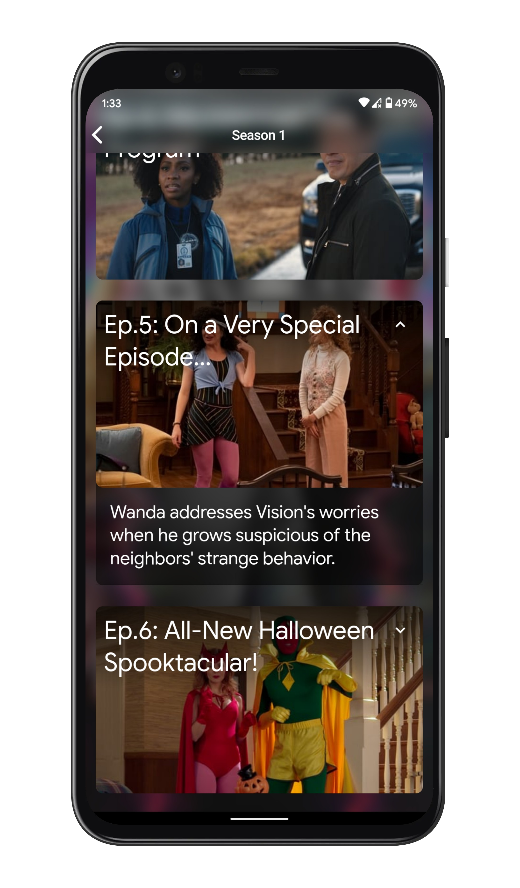

# Moovy

Movies Database Made with Flutter

## Screenshots
 

## Download Apk
https://github.com/aadesh-hemwani/Movies-and-Tv-Shows-App/blob/master/apk/Moovy%201.0.0.apk?raw=true

## Getting Started

This project is a starting point for a Flutter application.

A few resources to get you started if this is your first Flutter project:

- [Lab: Write your first Flutter app](https://flutter.dev/docs/get-started/codelab)
- [Cookbook: Useful Flutter samples](https://flutter.dev/docs/cookbook)

For help getting started with Flutter, view our
[online documentation](https://flutter.dev/docs), which offers tutorials,
samples, guidance on mobile development, and a full API reference.
